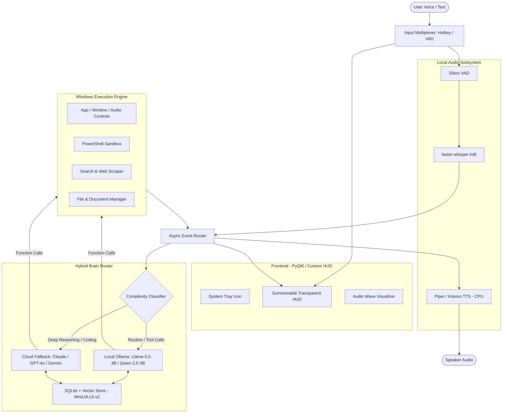

# 🛡️ Project Jarvis: Product Requirements Document (PRD)

---

## 1. Executive Summary & Vision
**Project Jarvis** is an always-on, ultra-responsive, privacy-focused, personal AI desktop companion engineered specifically for Windows. It acts as an autonomous executive assistant capable of bi-directional voice conversation, deep Windows OS control, persistent episodic memory, multi-step tool orchestration, and intelligent local/cloud hybrid reasoning—all tuned to operate within a strict **4GB VRAM hardware ceiling (NVIDIA RTX 3050A)**.

---

## 2. Target Persona & Core Value Proposition
- **User:** Power user, developer, and multitasker.
- **Problem:** Existing AI assistants (Siri, Cortana, Alexa) lack tool execution depth, local privacy, and custom workflow execution. Web LLMs (ChatGPT/Claude web) require manual copy-pasting, lack OS hooks, and incur high API subscription costs for trivial queries.
- **Solution:** A zero-latency summonable desktop overlay that executes complex system workflows, talks back naturally via neural TTS, remembers user context indefinitely, and offloads heavy tasks to the cloud only when required.

---

## 3. Hardware Constraints & VRAM Allocation Model
With an **NVIDIA RTX 3050A (4GB VRAM)**, system VRAM must be rigorously managed to prevent Windows DWM (Desktop Window Manager) stutter or Out-Of-Memory (OOM) crashes.

### VRAM & Resource Budget Allocation
```
+-----------------------------------------------------------------------+
| TOTAL VRAM BUDGET: 4,096 MB (RTX 3050A)                               |
+-----------------------------------------------------------------------+
| [GPU] Windows OS / DWM & Display Buffer         : ~800 MB - 900 MB    |
| [GPU] Local LLM (Qwen 2.5 1.5B)                 : ~980 MB - 1,100 MB  |
| [CPU/GPU] STT (faster-whisper base.en int8)     : ~200 MB (or CPU)   |
| [CPU RAM] TTS Engine (Kokoro-ONNX / Piper)      : 0 MB VRAM (CPU ONNX)|
| [CPU RAM] Embeddings & Vector DB (MiniLM-L6-v2) : 0 MB VRAM (CPU RAM) |
| FREE SAFETY HEADROOM                            : ~1,900 MB - 2,100 MB|
+-----------------------------------------------------------------------+
```

---

## 4. Key Functional Requirements (FR)

### FR-1: Interaction & Trigger Layer
- **Global Hotkey:** Instant summon/dismiss via configurable hotkey (`Ctrl + Shift + J` or `Ctrl + J`).
- **Push-to-Talk & Wake-Word:** Toggle between Hold-to-Talk / Tap-to-Talk or lightweight local wake-word (`openWakeWord`).
- **Floating Glass HUD:** Borderless, futuristic, semi-transparent HUD with audio wave visualizer, markdown chat stream, and live tool execution cards.
- **System Tray Agent:** Background resident process with tray icon showing status (Idle, Listening, Thinking, Speaking, Tool Running).

### FR-2: Voice Pipeline (Speech-to-Speech)
- **Voice Activity Detection (VAD):** `Silero VAD` running locally to detect start and end of speech with zero CPU lag.
- **Speech-to-Text (STT):** `faster-whisper` (base.en/small.en int8 quantization) delivering <300ms transcription latency.
- **Text-to-Speech (TTS):** Local neural voice synthesizer (`Piper TTS` or `Kokoro-82M ONNX`) delivering high-fidelity, expressive, low-latency audio stream playback (<150ms time-to-first-audio chunk).
- **Interruption Capability:** User speaking immediately halts current TTS playback and triggers new query processing.

### FR-3: Hybrid Brain & Intelligent Router
- **Tier 1 (Local Model):** Ollama / llama-cpp-python running `Llama-3.2-3B-Instruct` or `Qwen2.5-3B-Instruct` (Q4_K_M) for intent classification, quick queries, and direct OS tool calls.
- **Tier 2 (Cloud Escalation Fallback):** Automatic escalation to Claude 3.5 Sonnet / OpenAI GPT-4o / Gemini 2.0 Flash when:
  - Task complexity exceeds local context or coding capability.
  - Multi-page deep research or complex synthesis is explicitly requested.
  - User explicitly invokes cloud mode ("Jarvis, use cloud brain for this...").

### FR-4: Windows Automation & Tool Ecosystem
- **System Operations:** Launch/close apps, maximize/minimize, switch active windows, lock workstation, change volume, adjust brightness, toggle Wi-Fi/Bluetooth.
- **Shell & Script Execution:** Secure PowerShell / CMD execution sandbox for automation scripts.
- **Web Navigation & Search:** DuckDuckGo / Tavily search tool + Playwright / BeautifulSoup web page scraper.
- **File System Manager:** Search files across drives (via Windows Search API / `Everything` SDK), read/write/organize files, summarize documents (PDF, Markdown, TXT, CSV).
- **Media Controller:** Media keys control (Play/Pause, Next/Prev), Spotify desktop integration.
- **Clipboard & Vision (Optional Ext):** Read active clipboard content or capture active monitor screenshot for visual query ("Jarvis, explain what's on my screen").

### FR-5: Long-Term Episodic Memory & Context
- **Short-Term Memory:** Rolling sliding context with auto-summarization.
- **Long-Term Memory:** Hybrid Search (Semantic Embeddings via `all-MiniLM-L6-v2` + Full-Text SQLite FTS5) storing:
  - User preferences, nicknames, routines, project paths.
  - Historical facts and previous tasks.
- **Memory Management Commands:** "Jarvis, remember that my project folder is X", "Jarvis, forget what I said about Y".

---

## 5. Non-Functional Requirements (NFR)

| Metric | Target Specification |
|---|---|
| **Cold Startup Time** | < 3.5 seconds to background tray ready state |
| **Summon Hotkey Latency** | < 80ms to display HUD |
| **Voice-to-First-Action Latency** | < 900ms (VAD + Whisper + Local 3B Model decision) |
| **TTS First Audio Chunk Latency** | < 200ms streamed via PyAudio |
| **Idle System Footprint** | < 150MB RAM when LLM is idle / zero CPU usage |
| **Reliability & Error Handling** | Graceful degradation if local LLM server is busy or network drops |
| **Safety & Sandboxing** | Destructive commands (e.g. `rmdir /s`, deleting files, registry edits) require explicit vocal/GUI confirmation |

---

## 6. System Architecture Diagram



---

## 7. Release Roadmap

- **Phase 1: Core Foundation & Audio Loop**
  - Project scaffolding, hotkey daemon, Silero VAD, faster-whisper, Piper/Kokoro TTS, basic streaming audio.
- **Phase 2: Local Brain & Tool Calling Engine**
  - Ollama integration (Llama-3.2-3B/Qwen2.5-3B), function calling registry, Windows OS tools (apps, media, volume, PowerShell runner).
- **Phase 3: Persistent Memory & Cloud Hybrid Router**
  - SQLite + vector embedding engine, user preferences storage, dynamic complexity classifier & cloud escalation.
- **Phase 4: Futuristic UI & Polish**
  - Polished PySide6 glassmorphism HUD, sound effects (Iron Man style chimes), multi-step workflow planner, safety confirmations.
