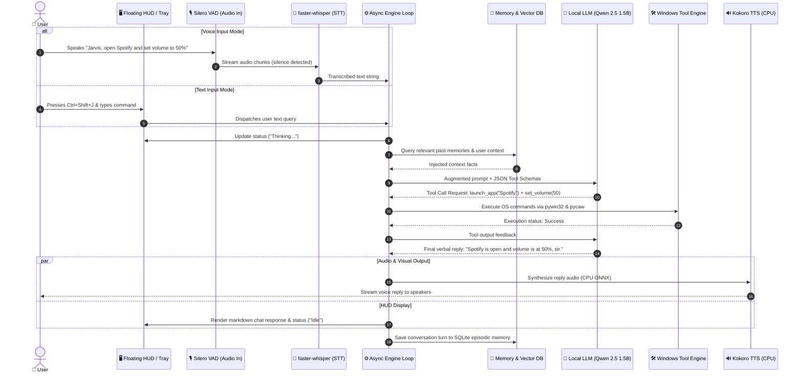
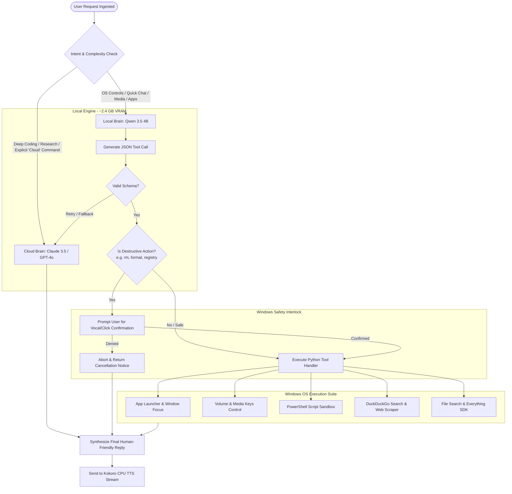
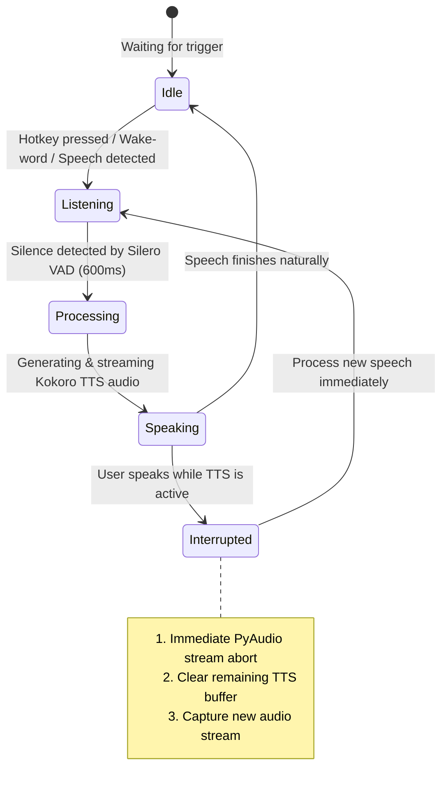
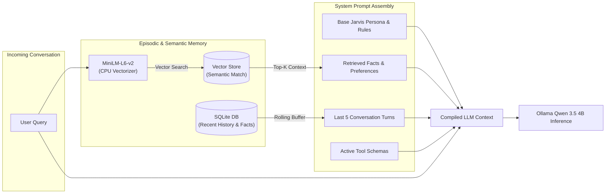

# 🧭 Project Jarvis: System Workflow & Lifecycle Diagrams

This document illustrates the end-to-end data pipelines, event loops, VRAM allocation flows, and decision-making logic powering **Project Jarvis**.

---

## 1. 🎙️ End-to-End Voice & Text Interaction Loop

This diagram maps the complete journey from user input (voice or hotkey text) to tool execution and neural voice playback.



---

## 2. 🔀 Hybrid Brain & Tool Routing Workflow

How Jarvis dynamically chooses between the local Qwen 3.5 4B brain and cloud API escalation.



---

## 3. ⚡ Voice Interruption (Barge-In) Handling

How Jarvis instantly stops speaking and listens when you interrupt him mid-sentence.



---

## 4. 💾 Dual-Layer Memory & Context Pipeline



---

## 5. 🖥️ Physical Hardware & VRAM Resource Layout

Exact mapping of how models and processes share hardware on your **RTX 3050A (4GB VRAM)** laptop with pre-installed `qwen3.5:4b`.

```
+-----------------------------------------------------------------------------------------+
|                                    NVIDIA RTX 3050A (4GB VRAM)                          |
+-----------------------------------------------------------------------------------------+
| [▓▓▓▓▓▓▓▓▓▓] Windows 11 DWM & Desktop Display Buffer       : ~850 MB                    |
| [▓▓▓▓▓▓▓▓▓▓▓▓▓▓▓▓▓▓▓▓▓▓▓▓▓▓▓▓] Qwen 3.5 4B in Ollama       : ~2,500 MB                  |
| [▓▓▓] faster-whisper base.en (int8 on CUDA)                : ~200 MB                    |
| [░░░░░░░░] Free GPU Safety Headroom                        : ~546 MB (STABLE & SAFE)    |
+-----------------------------------------------------------------------------------------+

+-----------------------------------------------------------------------------------------+
|                                      SYSTEM CPU & RAM                                   |
+-----------------------------------------------------------------------------------------+
| [⚙️ CPU Core] Silero VAD (Voice Activity Detection)         : < 1% CPU                   |
| [⚙️ CPU Core + ONNX] Kokoro-82M Neural TTS Engine          : ~120 MB RAM / <100ms chunk |
| [⚙️ CPU Core] all-MiniLM-L6-v2 Embeddings & SQLite DB       : ~110 MB RAM                |
| [⚙️ CPU Core] PyQt6 Floating Glass HUD & Global Hotkeys    : ~70 MB RAM                 |
+-----------------------------------------------------------------------------------------+
```
